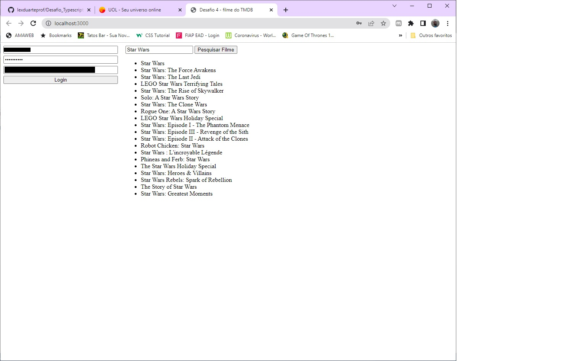

# PROJETO PARA ESTUDO DE TAPESCRIPT
* Este projeto foi elaborado para resolução de 4 desafios que consistem em refatorar arquivos javascript, para o Tapescript.
* O desafio mais trabalhoso foi o 4, que consistem em acessar via API, a base de filmes do TMDB.
* Abaixo, um print do sistema elaborado para o desafio 4 em funcionamento:

